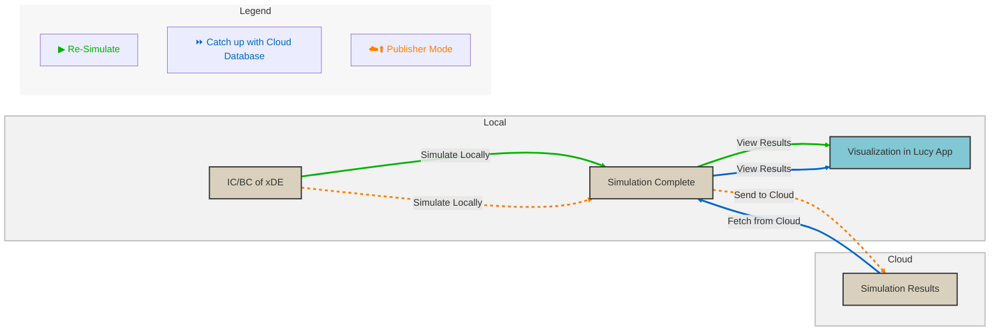

# Diagram

Here's a simple flowchart using *Mermaid*:



## Some Rust Code

```{.rust .cb-code}
use std::error::Error;
use log::info;

extern crate mesh_cartography_lib;

fn main() -> Result<(), Box<dyn Error>> {
    mesh_cartography_lib::init_logger();
    info!("Simulation Logger initialized.");
}
```
