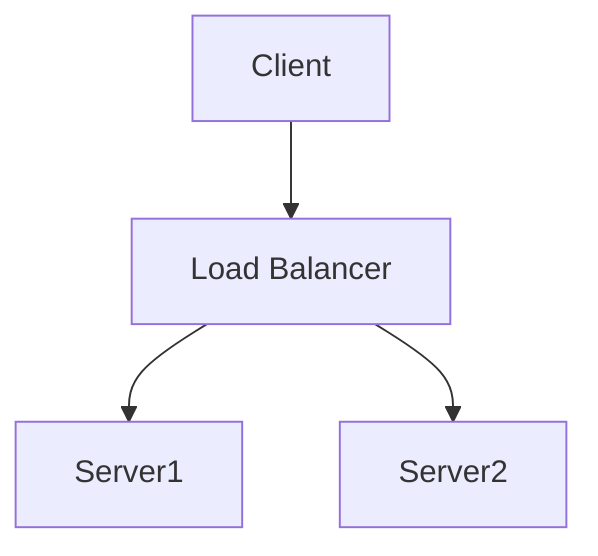

# Diagram

Here's a simple flowchart using *Mermaid*:



## Some Python Code

Only a function for printing "Hello, World!" in Python:

```{.python .cb-code}
def hello_world():
    print("Hello, World!")
```
